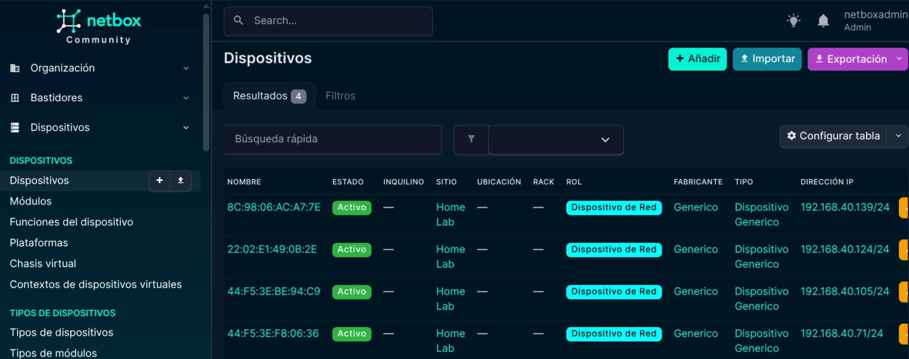
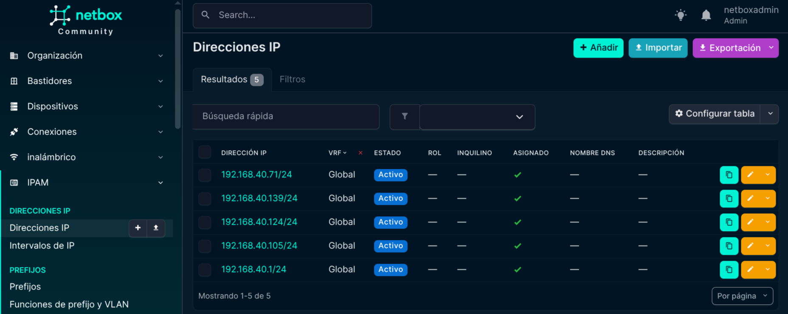

# NetDevOps - Inventario Automatizado de Red

Herramienta de automatización que escanea una red local usando **Nmap**, descubre dispositivos activos y registra automáticamente el inventario en **Netbox** (fuente de verdad). También mapea todo el rango de IPs del prefijo indicando cuáles están en uso y cuáles disponibles.

## Arquitectura
Red local (192.168.x.0/24)
↓
Nmap (ARP scan)
↓
Script Python
↓
API REST de Netbox
↓
Inventario actualizado

## Datos que registra

- **Dispositivos**: MAC address como identificador único, hostname, sitio, rol y fabricante
- **Interfaces**: Interfaz virtual `Management` por dispositivo
- **IPAM**: Todas las IPs del rango con status `active` (en uso) o `available` (libre)
- **IP primaria**: Visible directamente en el listado de dispositivos

## Tecnologías utilizadas

| Herramienta 	| Rol 										|
|---------------|-------------------------------------------|
| Python 3 		| Lenguaje principal 						|
| Nmap 			| Escaneo y descubrimiento de red 			|
| python-nmap 	| Librería para controlar Nmap desde Python |
| requests 		| Comunicación con la API REST de Netbox 	|
| python-dotenv | Gestión de variables de entorno 			|
| Netbox 		| Fuente de verdad del inventario 			|
| Docker 		| Despliegue de Netbox 						|
| Git 			| Control de versiones 						|

## Estructura del proyecto
netdevops-inventario/
├── main.py              # Orquestador principal
├── scanner.py           # Lógica de escaneo con Nmap
├── netbox_client.py     # Cliente de la API de Netbox
├── config.py            # Lectura de variables de entorno
├── requirements.txt     # Dependencias Python
├── .env                 # Variables de entorno (no se versiona)
└── .gitignore

## Requisitos previos

- Python 3.11+
- Nmap instalado en el sistema
- Netbox corriendo y accesible
- Ejecutar con `sudo` para ARP scan

## Instalación

```bash
# Clonar el repositorio
git clone https://github.com/eduardoparisd/netdevops-inventario
cd netdevops-inventario

# Crear entorno virtual
python -m venv venv
source venv/bin/activate

# Instalar dependencias
pip install -r requirements.txt
```

## Configuración

Crea el archivo `.env` en la raíz del proyecto:
NETBOX_URL=http://TU_IP_O_DOMINIO
NETBOX_TOKEN=tu_token_de_netbox
NETWORK_RANGE=192.168.40.0/24

### Obtener el token de Netbox

1. Inicia sesión en Netbox
2. Ve a tu perfil → **API Tokens**
3. Crea un token nuevo y cópialo

### Estructura requerida en Netbox

Antes de correr el script, crea estos objetos en Netbox:

| Objeto 		| Valor 				 |
|---------------|------------------------|
| Site 			| `Home Lab` 			 |
| Manufacturer 	| `Generic`   			 |
| Device Type 	| `Dispositivo Generico` |
| Device Role 	| `Dispositivo de Red`   |
| Prefix (IPAM) | Tu rango de red 		 |

## Uso

```bash
sudo venv/bin/python main.py
```

> **Nota**: Se requiere `sudo` porque Nmap necesita permisos de bajo nivel para realizar ARP scan y obtener las MAC addresses de los dispositivos.

## Resultado esperado
=== Iniciando inventario de red ===
Escaneando red: 192.168.40.0/24
Dispositivos encontrados: 5
Procesando 192.168.40.1 (8C:98:06:AC:A7:7E)
Dispositivo existente: 8C:98:06:AC:A7:7E (ID: 1)
IP 192.168.40.1 asignada a interfaz de dispositivo ID 1
IP primaria 192.168.40.1 asignada al dispositivo ID 1
=== Registrando todas las IPs del rango ===
IP 192.168.40.2 registrada con status: available
...
=== Inventario completado ===

## Capturas de pantalla

### Dispositivos registrados en Netbox



### IPAM - Mapa de IPs



## Problemas conocidos

**El script falla con error de DNS al usar sudo**
Sudo no siempre hereda la configuración DNS del usuario. Solución: usar la IP directa del servidor Netbox en `NETBOX_URL` y agregar el header `Host` en `netbox_client.py`.

**No aparece la MAC de tu propia máquina**
Es comportamiento normal. ARP no funciona contra localhost, la MAC del equipo que ejecuta el script aparece vacía.

## Próximos pasos

- [ ] Soporte para múltiples rangos de red
- [ ] Ejecución automática con cron job
- [ ] Integración con Ansible para despliegue remoto
- [ ] Pipeline CI/CD con GitHub Actions

## Aprendizajes

Este proyecto es parte de un roadmap de aprendizaje **NetDevOps**. Cubre conceptos de:
- Automatización de inventario de red
- Consumo de APIs REST con Python
- GitOps aplicado a infraestructura
- Docker y despliegue de herramientas de red

---

**Autor**: Eduardo Paris  
**Stack**: Python · Nmap · Netbox · Docker(Dokploy) · Git
